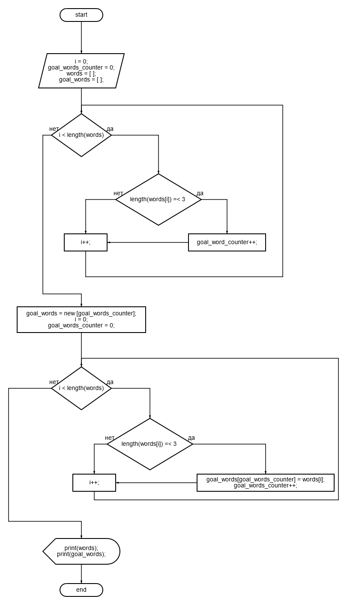

# Описание решения итоговой контрольной работы по первому блоку обучения
Требуется написать программу, которая из предложенного массива строк выбирает подмассив строк, длина которых меньше или равна трём.

## Алгоритмическая формулировка задачи
Необходимо написать компьютерную программу в соответствии со следующим алгоритмом:

## Собственно описание решения:

1. Программа просит пользователя ввести с клавиатуры любое количество слов через пробел.
2. Введенная строка разбивается на подстроки (разделитель - пробел), которые сохраняются в отдельный массив строк.
3. В цикле по данному массиву строк длина каждой строки проверяется на предмет является ли она равной или меньшей трех символов. Если да, то счетчик подходящих строк увеличивается на единицу.
4. Если после прохождения всего массива счетчик подходящих строк остался равным нулю, то пользователю выдается сообщение, что в исходном массиве нет строк меньших или равных трём и программа завершает свою работу.
5. На основании счетчика подходящих строк инициализируется новый статический массив строк.
6. В цикле по исходному массиву строк длина каждой строки проверяется на предмет является ли она равной или меньшей трех символов. Если да, то в массив подходящих строк добавляется обнаруженная строка.
7. Исходный и новый массив распечатывается пользователю на экран и программа завершает свою работу.